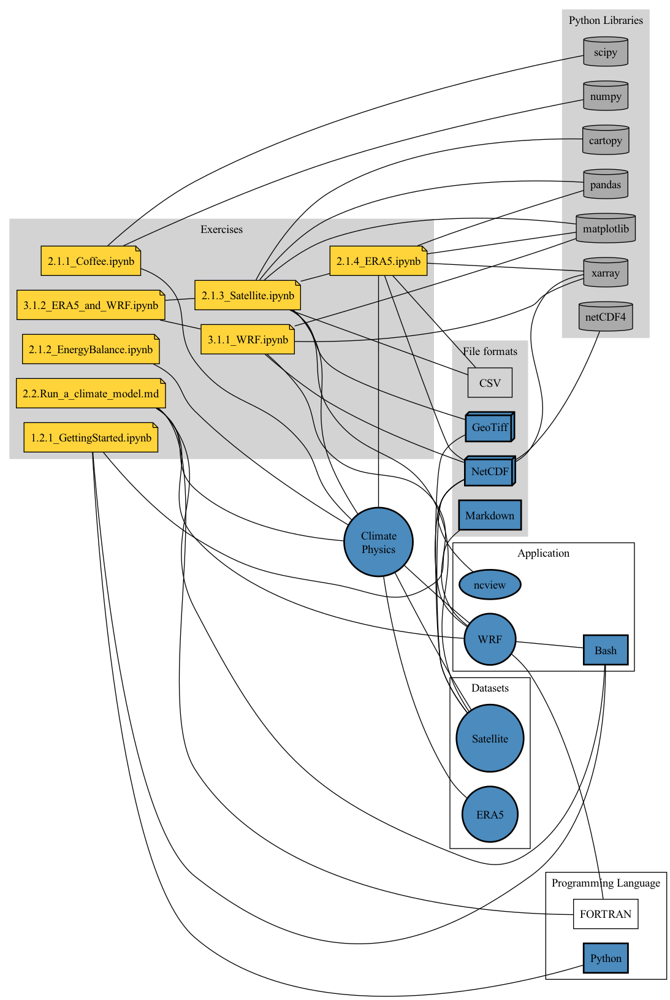

# Schedule

Feel free to join our Discord server for this winter school. [Invite to Discord Server](https://discord.gg/QzbwHKMH)

## Day 1 - Introduction to High-Performance Computing (NeSI)
- 9.00am - 3.00pm
    - [Link to NeSI's HPC intro](https://nesi.github.io/hpc-intro/)
- 3.30pm - 5.00pm
    - [1.2.1_GettingStarted.ipynb](1.2.1_GettingStarted.ipynb)
        - How to use a Jupyter notebook
        - Interacting with the notebook
        - Tiny introduction to the *Python* programming language

## Day 2 - Climate and Numerical Modelling
- 9.00am - 10.30am - *Intro to Numerical Climate Modelling*
    - [2.1.1_Coffee.ipynb](2.1.1_Coffee.ipynb)
        - Understanding that physical laws can be expressed as mathematical equatiions
        - Solving an Ordinary Differential Equation (ODE)
    - [2.1.optional_HeatEquation1D.ipynb](2.1.optional_HeatEquation1D.ipynb) (Optional)
    - [2.1.2_EnergyBalance.ipynb](2.1.2_EnergyBalance.ipynb)
        - Understand the global energy flows and how it affect temperature
        - Understand that Earth's energy balance can be modelled in the simplest of all climate models
- 11.00am - 12.30pm - *Working with Satellite and ERA5 re-analysis data*
    - [2.1.3_Satellite.ipynb](2.1.3_Satellite.ipynb)
        - Loading and visualizing satellite data
        - Loading and visualizing point data (e.g., cyclone tracks)
        - Georeferencing such datasets
    - [2.1.4_ERA5.ipynb](2.1.4_ERA5.ipynb)
        - Explore ERA5 as your first climate dataset
        - Understand the file structure of a *NetCDF* file
        - Understand the difference between *dimensions*, *coordinates*, and *variables*
        - Understand how to select a variable and put it on a map
    - [2.1.optional_MapProjections.ipynb](2.1.optional_MapProjections.ipynb) (Optional)
    - 1.30pm - 3.00pm - *How to setup up WRF & Submitting WRF to the Cluster*
        - [2.2.Run_a_climate_model.md](2.2.Run_a_climate_model.md)
- 3.30pm - 5.00pm - *Submitting WRF simulations to the Cluster*
    - Checking model input files (objective: practice learnt bash commands, [ncview], grep, nano)
    - Writing a WRF submit script (objective: understanding HPC queue, bash script)
    - Changing model parameters/inputs (objective: experimental design, sensitivity testing, python script)
    - Submitting a WRF job (objective: understand logging, error messages, queue, bash script, nano)

## Day 3 - Analysis and Interpretation of WRF Model Output
- 9.00am - 10.30am - *Load and plot WRF output files*
    - [3.1.1_WRF.ipynb](3.1.1_WRF.ipynb)
        - Load WRF output file(s) and inspect variables
        - Select variables for a location
        - Make quick maps and plots
        - Make georeferenced WRF output
- 11.00pm - 12.30pm - *Putting it all together*
    - [3.1.2_ERA5_and_WRF.ipynb](3.1.2_ERA5_and_WRF.ipynb)
        - Combining everything you have learned so far:
            - Loading satellite images
            - Loading ERA5 data
            - Loading WRF outputs
            - Making maps
            - Georeferencing data
    - [3.1.optional_Colormaps.ipynb](3.1.optional_Colormaps.ipynb) (Optional)
- 1.30pm - 3.00pm - *Everything you always wanted to know about Climate Modelling...*

---

