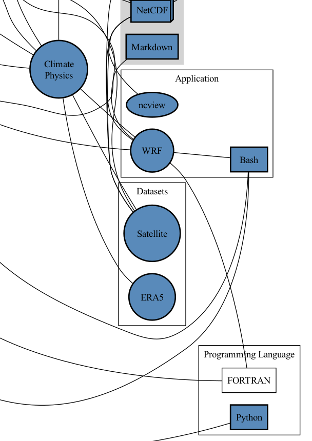
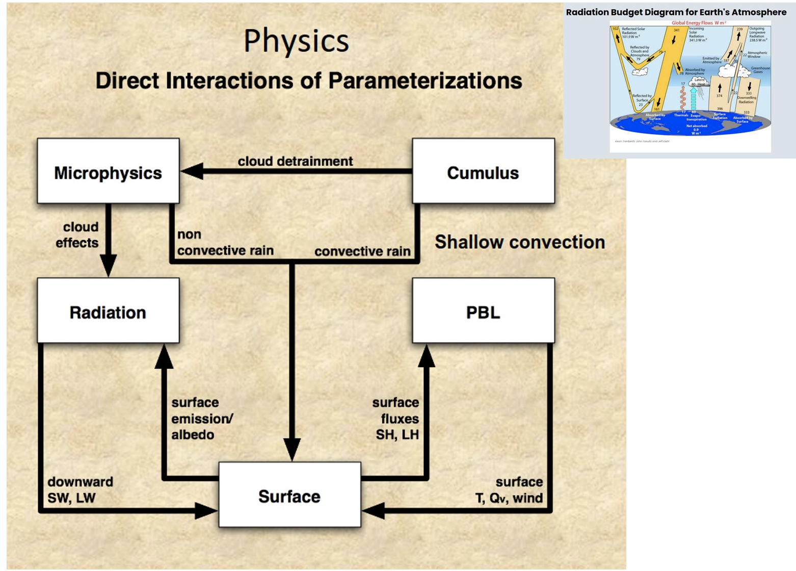
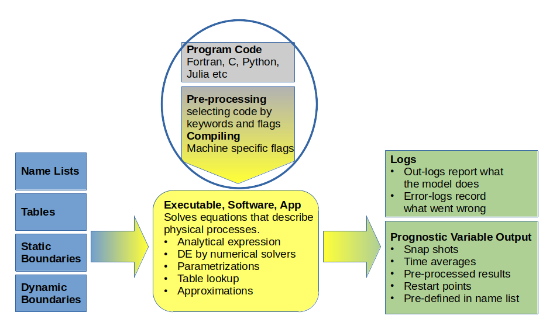

# Run the WRF climate model

## Objectives

In this session, you will
- Set up a climate model environment
- Configure and run a climate model
- Change the model parameters and observe the effects on the simulation
- Troubleshoot common issues during model runs

## Exercises
- Checking model input files (objective: practice learnt bash commands, ncview, grep, nano)
- Writing a WRF submit script (objective: understanding HPC queue, bash script)
- Changing model parameters/inputs (objective: experimental design, sensitivity testing, python script)
- Submitting a WRF job (objective: understand logging, error messages, queue, bash script, nano)



## What is WRF?

WRF stands for Weather Research and Forecasting Model, it is a *community model*, which means that it is a free and shared resource with distributed development and centralized support.

[Github](https://github.com/wrf-model/WRF) -  [Official website](https://www.mmm.ucar.edu/models/wrf/) - [Wikipedia](https://en.wikipedia.org/wiki/Weather_Research_and_Forecasting_Model) - [Support forum](https://forum.mmm.ucar.edu/)

This model is used in different ways such as weather prediction, research and applications:
- numerical weather prediction
- case studies (meteorology)
- regional climate simulations
- applications (air quality, wind energy,...)



[source](https://www2.mmm.ucar.edu/wrf/users/workshops/WS2014/ppts/best_prac_wrf.pdf)

<label id="my-label"></label>

The model contains full physics options to represent atmospheric radiation, the surface and boundary layer, and cloud and precipitation processes.


[source](https://web.archive.org/web/20220517143616/http://bioearth.wsu.edu/wrf_model.html)

The numerical model solves the equations within a specified domain. It can be visualised as a cube with 3 dimensions: x (longitude), y (latitude) and z (vertical levels). These dimensions are divided into gridcells, within which all the calculations are carried out in the form of big coding loops along the dimensions. Note that the variables are defined at different places in the gridcell (centre or along the edges) but we won't be discussing this today. 

## Your own WRF setup

### Setting up the run directory

- Create a *run_control* directory within a *wrf_exercises* folder in your workspace user directory.
- Copy the *software* (executable *wrf.exe*) into the run directory

```bash
#[code snippet 1]

cd /nesi/nobackup/nesi99991/ASP_winterschool2023/workspace/<your_user_directory>
mkdir wrf_exercises
cd wrf_exercises
mkdir run_control

# copy the executable (a file) to your run directory
cp /nesi/nobackup/nesi99991/ASP_winterschool2023/WRF_exercises/run_control/wrf.exe run_control/

# alternative (more practical) way of navigating the folder structure​: descend into target directory
cd run_control
# make sure you are in your own directory
pwd
# pwd should yield: /nesi/nobackup/nesi99991/ASP_winterschool2023/workspace/<your_user_directory>/wrf_exercises/run_control]

# copy executable to your run directory
cp /nesi/nobackup/nesi99991/ASP_winterschool2023/WRF_exercises/run_control/wrf.exe .
# also copy the script to launch the application
cp /nesi/nobackup/nesi99991/ASP_winterschool2023/WRF_exercises/run_control/launch_wrf.sl .
```

- Check out the *launch_wrf.sl* and fill it in
- Submit the job - always use debug mode first to see if the job actually starts running

```bash
#[code snippet 2]


# look at launch_wrf.sl and fill out with your nesi credentials etc
nano launch_wrf.sl
# alternative: double-click on the file in the file explorer on the left, but make sure you save the file once you are finished!

# fill in your account no
#SBATCH --account=nesi99991  # this is the number for this training session, you will get your own one if you apply for Nesi compute time

# also indicate the queue
#SBATCH --reservation=ASP23  # this is not always required and has been set up specifically for this training

# and the partition 
#SBATCH --partition=milan

# make sure enough memory is assigned
#SBATCH --mem=240g

# pipe the model runtime log into a separate file
srun ./wrf.exe >& wrf.log

# submit the script (make sure it is saved and closed first)
sbatch launch_wrf.sl

```

this should yield: *submitted job XXXXXX* <- this is your jobid!

- See how the job is doing:
    - check the job status ``` squeue -u <username> ```
    - list all the files in the directory  ``` ls -l ```
    - different files were generated: `rsl.error.xxxxx` - `rsl.output.xxxx` - `wrf.log` - `slurm-xxxxx`
    - look at the *logfiles* - always the first go-to: ```cat wrf.log ``` and ```cat rsl.error.0000```

- The *rsl.error.0000* file indicates: 

```
file not found, unit 27, file /scale_wlg_nobackup/filesets/nobackup/nesi99991/ASP_winterschool2023/workspace/<your_user_directory>/wrf_exercises/run_control/namelist.input
```

- To kill a job: ``` scancel <jobid> ```


### Copy all the necessary files

We now have a *binary / software / app / program / executable* , but other types of files are needed to run the simulation: 

- namelists: one or more list of file names, paths, parameters, flags, switches,.. The entries are expressed by *some_name =  value*
- tables: lookup lists of physical constants (solar constant, Stefan Boltzmann, gravity), land use or vegetation types, grain radius etc...
- static fields: fields containing the physical variables that do not change throughout the simulation: elevation, domain geometry, slope, landmask,.. as well as the initial conditions the model starts with at the first timestep (temperature, pressure, winds,...). These can be 1D, 2D or 3D. 
- dynamic fields: fields containing the physical variables that change over time and are used to force the model throughout the simulation. These are boundary conditions and forcing conditions and can be 2D, 3D or 4D (same as above but the time dimension is added).

Copy the input files
<label id="my-label3"></label>
- **namelist.input**

```bash
#[code snippet 3]

#copy the namelist
cp /nesi/nobackup/nesi99991/ASP_winterschool2023/WRF_exercises/run_control/namelist.input .

#let's inspect the namelist, show the whole list
cat namelist.input
#or just view the top 40 lines
head -40 namelist.input
#0r view the bottom 30 lines
tail -30 namelist.input
```

What do these lines mean?

- `start_year = 2023`
- `sst_update = 1`
- `fractional_seaice = 1`

#### Copy **tables**

```bash
#[code snippet 4]

cp -v /nesi/nobackup/nesi99991/ASP_winterschool2023/WRF_exercises/run_control/*.TBL .
# -v verbose output

cp -v /nesi/nobackup/nesi99991/ASP_winterschool2023/WRF_exercises/run_control/ozone* .
cp -v /nesi/nobackup/nesi99991/ASP_winterschool2023/WRF_exercises/run_control/RRTM* .
```

#### Copy **boundary and forcing files**

Copy the input files that provide the static and dynamic fields to the model :

```bash
#[code snippet 5]

# check if the files are present in the source folder. This is a good command to check if *cp* will pull the right files
ls /nesi/nobackup/nesi99991/ASP_winterschool2023/WRF_exercises/run_control/wrf*_d01
# the '*' lists all files starting with 'wrf' and ending with '_01' in this directory. Used alone, * means 'everything' and can also be used as *.png (all the files ending with the .png extension) or as image* (all files with a name starting with 'image').

# copy the files over
cp /nesi/nobackup/nesi99991/ASP_winterschool2023/WRF_exercises/run_control/wrf*_d01 .
```

To inspect these files, we need to open a *Virtual Desktop session*. Open a new kernel window and choose the Virtual Desktop app:

 

In there, open a terminal window and navigate to your current directory. Then, open [ncview](https://cirrus.ucsd.edu/ncview/) and look at the files. 


```bash
#[code snippet 6]

cd /nesi/nobackup/nesi99991/ASP_winterschool2023/workspace/<your_user_directory>/wrf_exercises/run_control/

module load ncview #we need to load the ncview program

ncview wrfinput_d01 # to actually open the file
```

What are those files? Open those files and inspect the variables HGT, U and V. What are they? What are their dimensions (2,3 or 4D)? How would you calculate the wind?

The WRF input files:

- `wrfinput_d01`: contains the initial conditions and the static fields

- `wrfbdy_d01`: these are the lateral boundary conditions that are supplied to the model during the simulation. They are linearly interpolated in time to fit the current model time.
    - 3D fields of horizontal wind, temperature, geopotential height, water vapor,...
    - 2D fields of surface pressure,...
- `wrflowinp_d01`: these provide the *lower boundary* (ocean/land surface) conditions that are supplied step wise to the model (e.g. 6-hourly)
    - 2d fields of sea surface temperature, sea ice cover,...
    - vegetation fraaction,...

### Submit the run

Make sure you have copied all the required files above, then launch the model run.

```bash
sbatch launch_wrf.sl
```
The simulation will crash, once again. Check the log file and fix the error in the namelist.

```
Input data is acceptable to use: wrfinput_d01
input_wrf.F: SIZE MISMATCH: namelist  e_we = 229
input_wrf.F: SIZE MISMATCH: input file WEST-EAST_GRID_DIMENSION = 230
---- ERROR: Mismatch between namelist and input file dimensions
NOTE: 1 namelist vs input data inconsistencies found.
```

This is a refresher of [this, discussed earlier](#my-label).


Let's start the real control run (also called *baseline*)

- comment out this line: ```#SBATCH  -quos=debug ```
- increase the walltime to 2 hours (hint: it was set to 15 minutes)
- finally, submit the job ``` sbatch launch_wrf.sl ```


## Run a WRF simulation

Now that the model is running, let's create another reality. We will alter the input file to simulate an alternative world.

Choose one of these:

- *Exp1* Decrease the sea surface temperature (pre-industrial conditions)
- *Exp2* Increase the sea surface temperature (future warmer scenario)
- *Exp3* Flatten the southern Alps (all land = 0)
- *Exp4* remove all land of New Zealand **

** advanced


Create a new directory and re-copy the executable, launch script, namelist, tables and input files (see [earlier](#my-label3).). Remember, it is essential to **make copies** and **backups**. If you re-run the model, the new outputs will overwrite the old ones. Same if you copy something in a directory that already has a file with the same name, it will be overwritten. 

```bash
#[code snippet 7]

#check where you are now 
pwd

#make your way to 
cd /nesi/nobackup/nesi99991/ASP_winterschool2023/workspace/<your_user_directory>/wrf_exercises/

#create a new directory for the experiment of your choice
mkdir run_experiment

# copy the necessary files
cp <...>

# and make a copy of the imput files that will be altered (you never know...)
cp wrfinput_d01 wrfinput_d01_backup
cp wrflowinp_d01 wrflowinp_d01_backup

```

- Find out which variable to alter and what to apply. Copy the script to alter the initial/boundary conditions to your directory. It is in ```/nesi/nobackup/nesi99991/ASP_winterschool2023/WRF_exercises/run_experiment<exp#>/exp<exp#>.ipynb```

! remember to check that you are in the right location and use ```cp``` to copy.

In the file manager on the left, open the python script (double-click) and fill in the missing path to indicate where your input is (```/nesi/nobackup/nesi99991/ASP_winterschool2023/workspace/<your_user_directory>/wrf_exercises/run_control/```, then run the script once. 

- <label id="my-label2"></label>Make sure that you have correctly altered the input file. You can either go back to the *Virtual Desktop* and use ncview (hover your mouse over a location in both files and check if the values are different). As an alternative, you can compare the two files directly with [CDO](https://www.google.com/url?sa=t&rct=j&q=&esrc=s&source=web&cd=&ved=2ahUKEwjR14Xetr-BAxXrcmwGHQMBBgAQFnoECB0QAQ&url=https%3A%2F%2Fmpimet.mpg.de%2Fcdo&usg=AOvVaw1t6_RalXUBjEgnAdGZTboH&opi=89978449).

```bash

#[code snippet 8]

# load CDO
module load CDO

# CDO command to subtract values from one file from the other, to check the differences. Syntax: cdo <operator> <inputfile1> <inputfile2> <outputfile>. Here <operator> is sub (subtract), <inputfile1> is the file you have just manipulated,<inputfile2> is the original file you have saved as backup and <outputfile> is created.
cdo sub wrfinput_d01 wrfinput_d01_backup diff.nc

# module load ncview
# dump the value of SST in the difference file
ncdump -v SST diff.nc

```


- Check that all the needed files are present in your *run_experiment* directory.
- Modify the launch file : assign a unique job name
- Test submit and then submit the job 

### The WRF model code

Let's dig into the WRF code. It can be found on [Github](https://github.com/wrf-model/WRF), and there is a copy in ```/nesi/nobackup/nesi99991/ASP_winterschool2023/WRF/```

We **will not do it** in the frame of this training, but the code should be copied and compiled to create the *wrf.exe* executable (see [here for more info](https://support.nesi.org.nz/hc/en-gb/articles/360002109696-WRF)).

Find where the Stefan Boltzmann constant is defined, what its value is and how is it used?

```bash

#[code snippet 9]

cd /nesi/nobackup/nesi99991/ASP_winterschool2023/

grep -i boltzmann WRF/*/*.F  # find the files that have 'blotzmann' in them

grep -i -C 5 boltzmann WRF/*/*.F # give 5 lines of context on either side

grep -i  -C 5 STBOLT WRF/*/*.F

```


This structure is not specific to WRF, most climate models (ocean, ice sheet, sea ice, land, atmosphere models) need similar 
- intputs (boundary conditions, ...)
- a compiled code (set of functions and equations) 
- the *recipe* (namelist) 

and outputs 
- log files
- model outputs

The differences are in the file formats (gib files, binaries, netcdf), in the programming language used (julia, fortran, C++) and the general organisation and number of files.

### Quick check 

If your models have been running and you have some outputs in the form `wrfout_d01_xxxx` in both directories, you can have a look at the differences, in the way we did [earlier](#my-label2).
The session tomorrow morning will cover looking at the WRF files in more details.


### Resources

You are very welcome to get in touch with Alex for setting up a WRF simulation: alexandra.gossart@vuw.ac.nz

Other resources: 
- the [Nesi page](https://support.nesi.org.nz/hc/en-gb/articles/360002109696-WRF) on how to install and compile WRF
- the [WRF portal](https://esrl.noaa.gov/gsd/wrfportal/)
- the [WRF official webpage](https://www.mmm.ucar.edu/models/wrf)
- the [Github repository](https://github.com/wrf-model/WRF)
- [tutorial](https://www2.mmm.ucar.edu/wrf/users/) to install and run the WRF model
- the [WRF Users support portal](https://forum.mmm.ucar.edu/)

